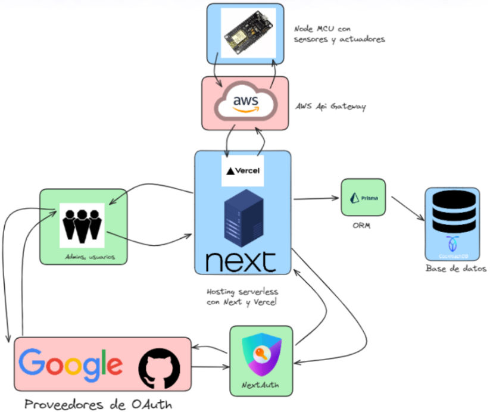

# Smart-Office

The way we work is evolving over time, with an increasing trend towards remote work. According to Forbes.com, 16% of companies worldwide now operate remotely, providing opportunities for employees to work from home. Remote work has seen a significant rise, with Bloomberg reporting a 14% increase post-pandemic compared to 4% before. Despite the growing popularity of remote work, not everyone enjoys working from home, leading people to explore alternative options such as cafes and libraries that offer internet connectivity. Renting offices remains a viable choice for many, although it can be a lengthy and inconvenient process with no guarantee of availability.

Smart Office addresses these challenges by prioritizing user comfort and convenience. The platform allows remote registration, customization of office temperature preferences, and tracking of work hours. It also ensures security by automatically closing doors upon user entry. Smart Office aims to deliver positive outcomes and cost savings for office administrators, incorporating features such as security alarms and insights into employee habits like leaving lights on. With adjustable curtains based on interior lighting, Smart Office provides a comfortable and secure solution for users while simplifying administrative processes.

This repository corresponds to the Smart Office IOT project, which can be divided in 2 parts: the webapp and the code for the ESP32 microcontroller. For a detailed explanation of each module, refer to the corresponding repository. 

## Webapp

The webapp is a T3 app that allows users to register and login to the platform. Once logged in, users can customize their office temperature preferences and track their work hours. The webapp also allows users to view the current temperatur of the office, as well as office availability. The webapp is hosted on Vercel and can be accessed at https://smart-office-git-master-oscar-gg.vercel.app/. In addition, the web app has API endpoints that allows the ESP32 microcontroller to upload new data. Furthermore, the webapp contains a section for administrators, which allows them manage the connected devices, modify RFID tags, obtain a high level overview of the office data, and manage users.

- Repository: https://github.com/Oscar-gg/smart_office

## ESP32 / Node MCU

The ESP32 microcontroller is responsible for controlling the office devices, such as the lights, curtains, and doors. It also collects data from the sensors and uploads it to the webapp. The ESP32 microcontroller is connected to the following devices:

- 1x Servo motor for the curtains
- 1x Servo motor for the door
- 3x LEDs for temperature status
- 1x RFID reader for office access
- 1x Temperature sensor
- 1x Light sensor
- 1x PIR sensor
- 1x Ultrasonic sensor

In the current implementation, there are 5 ESP32 microcontrollers, each one controlling some sensors and actuators. Each device has a name and a type that is set upon the NodeMCU initialization. The names and types are used to identify the device in the webapp, in order to send specific commands back to the devices.

- Repository: https://github.com/Oscar-gg/smart_office_nodemcu

## Architecture

## Links

- Presentation: https://drive.google.com/file/d/1GZ1KSHAlW-SPrht134YFVS8qdK8ElEHf/view?usp=sharing
- Demo video: https://youtu.be/wol7gAF8qnY